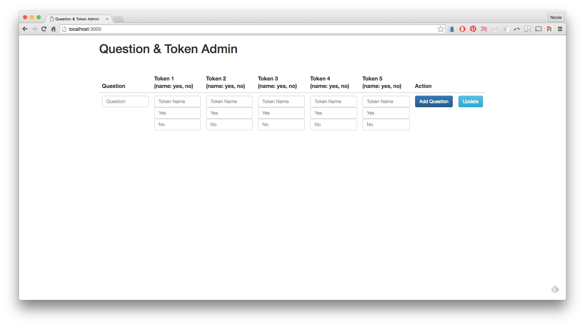
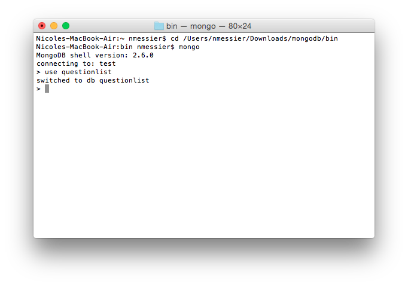
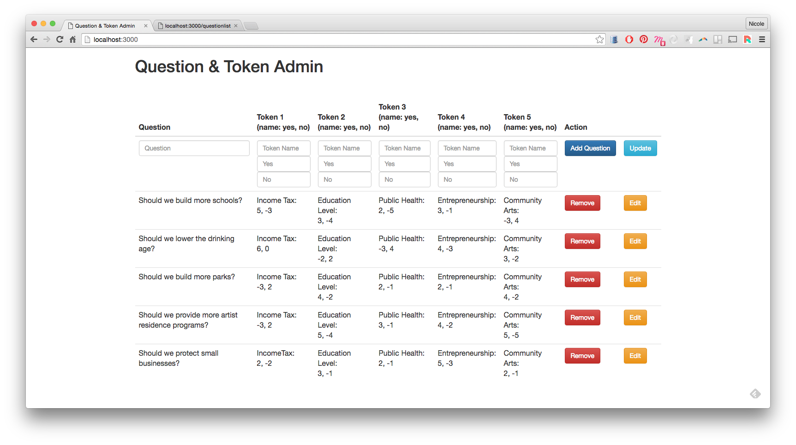
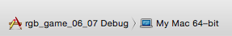
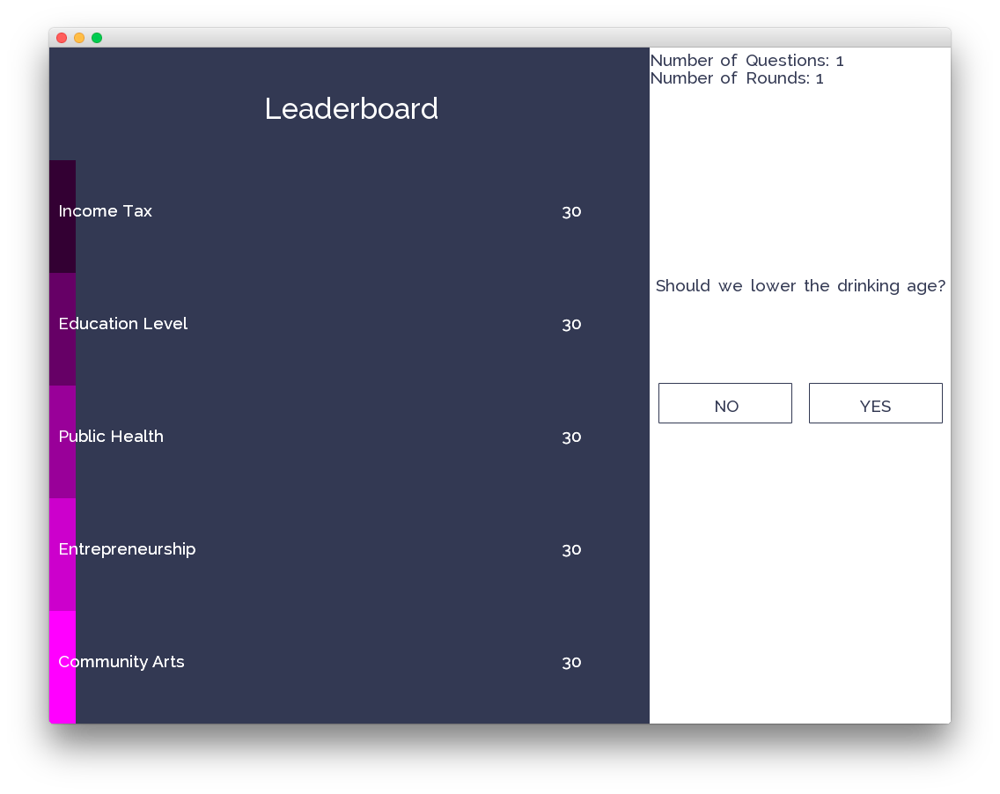
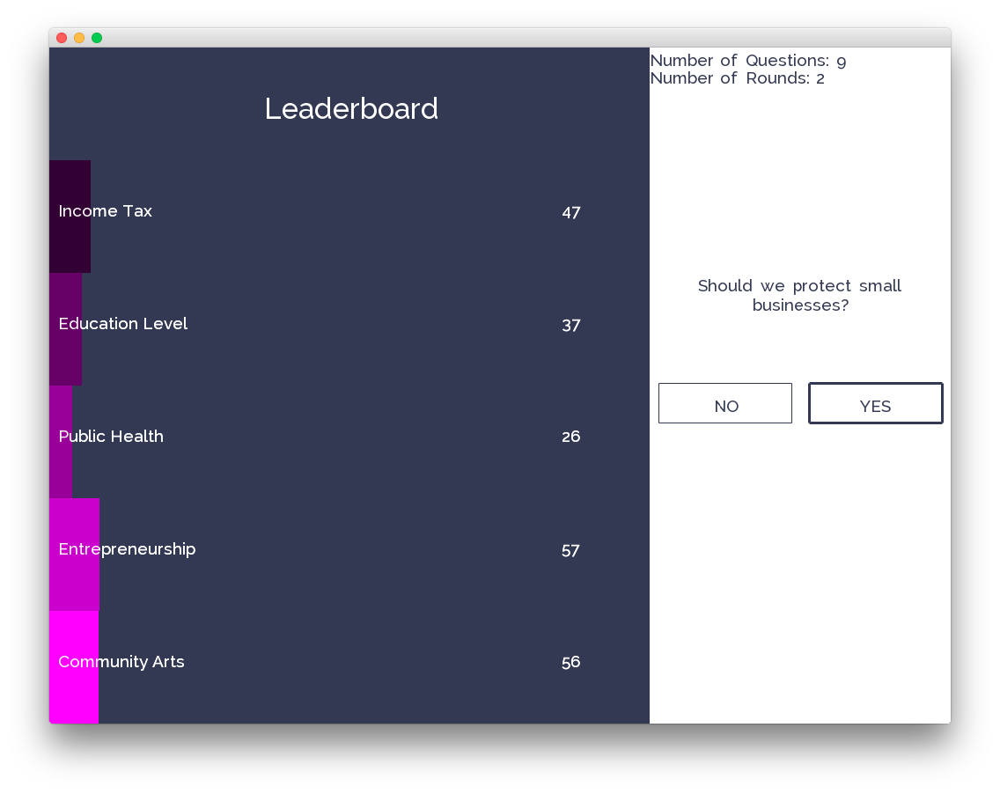
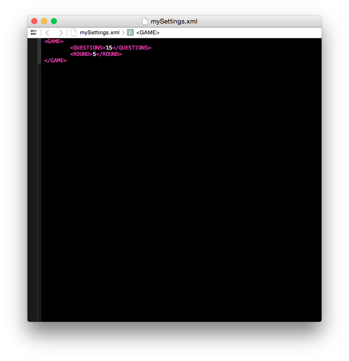

# RPG prototype
This is a prototype of an engagement platform system with the following components:

* Openframeworks App that serves as the front end user experience
* Single page MEAN Stack  application that serves as the admin interface to add questions, tokens, and change their associated relationships

A [demo video](https://www.youtube.com/) can be viewed here. 

##User Admin Setup

1. Open a terminal terminal window (or a command prompt for Windows) and CD into the admin folder. ```CD pathToAdminFolder/admin```
2. Execute the server.js file using Node.js interpreter by typing ```node server.js``` in your terminal window.
3. Launch [http://localhost:3000/](http://localhost:3000/) to view the admin application. 
4. Open a new terminal window and CD into the mongo/bin folder. Run the mongo shell by typing ```mongo```.
5. Create a database called questionlist by typing ```use questionlist``` and you should receive the following feedback -- ```switched to db questionlist```. Below is in image of the terminal commands for setting up your database. 
6. Insert dummy data into the database by typing ```
db.questionlist.insert([
{question: "Should we build more schools?", Tokens: {Token1: {name: "Income Tax", yes: "5", no: "-3"}, Token2: {name: "Education Level", yes: "3", no: "-4"}, Token3: {name: "Public Health", yes: "2", no: "-5"}, Token4: {name: "Entrepreneurship", yes: "3", no: "-1"}, Token5: {name: "Community Arts", yes: "-3", no: "4"}}}, {Tokens: {
Token1: {name: "Income Tax", yes: "6", no: "0"},Token2: {name: "Education Level",yes: "-2",no: "2"},Token3: {name: "Public Health",yes: "-3",no: "4"}, Token4:{name: "Entrepreneurship",yes: "4",no: "-3"},Token5: {name: "Community Arts",yes: "3",no: "-2"}},
question: "Should we lower the drinking age?"},{question: "Should we build more parks?",Tokens: {Token1: {name: "Income Tax",yes: "-3",no:"2"},Token2: {name: "Education Level",yes: "4",no: "-2"},Token3: {name: "Public Health",yes: "2",no: "-1"},Token4: {name: "Entrepreneurship",yes: "2",no: "-1"},Token5: {name: "Community Arts",yes: "4",no: "-2"}}},{question: "Should we provide more artist residence programs?",Tokens: {Token1: {name: "Income Tax",yes: "-3",no: "2"},Token2: {name: "Education Level",yes: "5",no: "-4"},Token3: {name: "Public Health",yes: "3",no: "-1"},Token4: {name: "Entrepreneurship",yes: "4",no: "-2"},Token5: {name: "Community Arts",yes: "5",no: "-5"}}},{question: "Should we protect small businesses?",Tokens: {Token1: {name:"IncomeTax",yes:"2",no: "-2"},Token2: {name: "Education Level",yes: "3",no: "-1"},Token3: {name: "Public Health",yes: "2",no: "-1"},Token4: {name:"Entrepreneurship",yes: "5",no: "-3"},Token5: {name: "Community Arts",yes: "2",no: "-1"}}}])```

7. Refresh the page and the table should be filled with the dummy data.  Visit [http://localhost:3000/](http://localhost:3000/questionlist).

8. To add, edit, or delete data via the interface:
	* DELETE: press the remove button
	* EDIT & UPDATE: press the edit button and the data will auto populate in the forms at the top of the table. Edit the text by typing, and once you're done, press update. 
	* CREATE: Type data into the form and once the form is complete, press the add question button. 
	* *Note: each question only has five tokens, and the user must maintain token name consistency across all questions. More on that in the next steps section. 


##Launching openFrameworks App
Once the database is populated and the server is running, run the openFrameworks app. Note that if the admin app is not running on local server 3000, the OF app will not work. 

1. Drag the rgb\_game\_06\_07 folder into your openFrameworks/app/myApps folder.
2. Open the application by clicking rgb\_game\_06\_07.xcodeproj
3. Make sure the active scheme is in debug mode <br> 
4. Press the play button in upper left hand corner, and the application should launch 
5. Press the no or yes button to engage. As you engage, the leaderboard will update. 
6. To change the number of questions per game and questions per round, open the XML file in the data/bin folder.
	* Question per game: change the number in between <QUESTIONS></QUESTIONS>
	* Questions per round: change the number in between <ROUND></ROUND> 
7.  The game is over when:
	* the questions per game has been reached
	* or the token value becomes a negative value

##Next Steps
###Admin Interface/Database
1. User should be able to add tokens that will populate into each JSON object in the JSON array.
2. User should not have to maintain consistency for each token across questions.
3. User should be able to add as many tokens as desired. 
4. Updates to the user interface styling.
5. Add an icon image to each token to use in the openFrameworks app leaderboard. 

###openFrameowkrs App
1. Add a restart button to the game over page.
2. Updates to the user interface styling.
3. Animations for leaderboard changes.
4. Add a launch page before going straight to the leaderboard. 